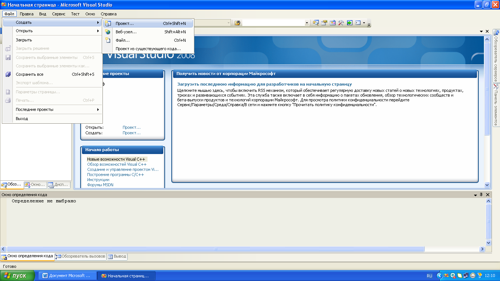
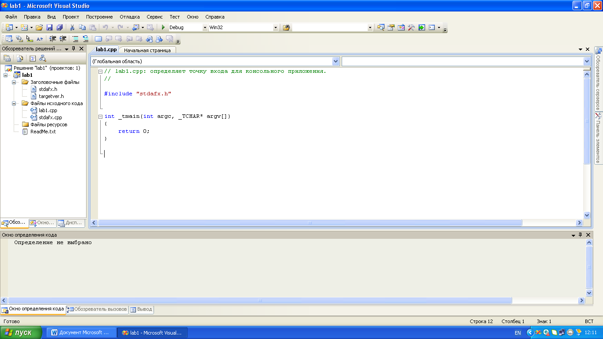
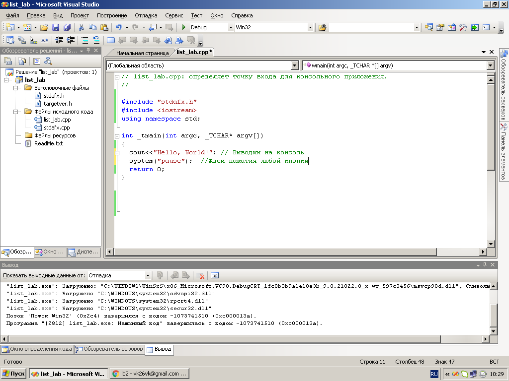
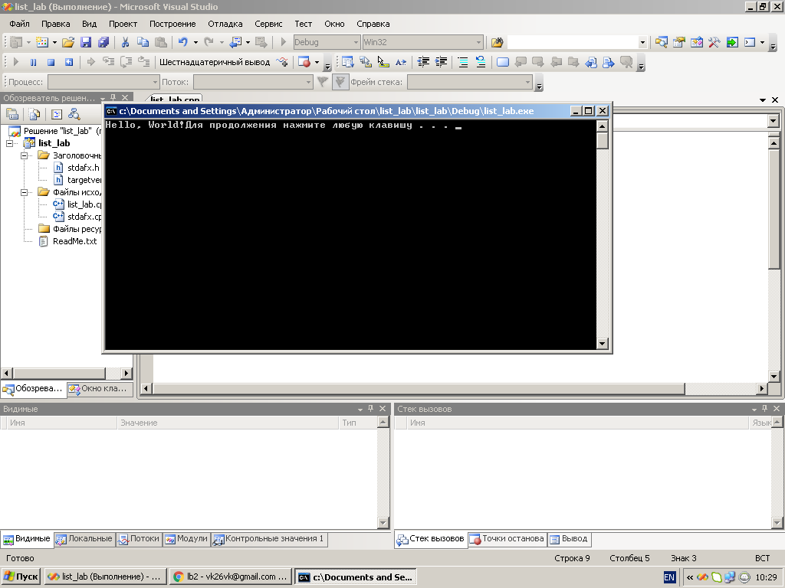

# Створення лінійної програми

## Перелік усіх робіт

1. [Створення лінійної програми](lab-01.md)
2. [Робота з типами даних. Введення-виведення даних](lab-02.md)
3. [Створення програми з розгалуженням](lab-03.md)
4. [Використання  циклів з параметром](lab-04.md)
5. [Використання  циклів з передумовою та післяумовою](lab-05.md)
6. [Робота з одновимірним масивом](lab-06.md)
7. [Робота з двовимірним масивом](lab-07.md)
8. [Робота з вказівниками](lab-08.md)
9. [Робота з рядками у програмі](lab-09.md)
10. [Використання функцій у програмі](lab-10.md)
11. [Опрацювання структур](lab-11.md)
12. [Опрацювання файлів](lab-12.md)
13. [Введення-виведення текстових даних в файл](lab-13.md)
14. [Створення класів ч.1](lab-14.md)
15. [Створення класів ч.2](lab-15.md)
16. [Використання механізму наслідування в класах](lab-16.md)
17. [Паралельні обчислення за допомогою стандарту OpenMP ч.1](lab-17.md)
18. [Паралельні обчислення за допомогою стандарту OpenMP ч.2](lab-18.md)
19. [Паралельні обчислення за допомогою стандарту OpenMP ч.3](lab-19.md)
20. [Паралельні обчислення за допомогою бібліотеки MPI](lab-20.md)


## Мета роботи 

Ознайомитись з IDE Visual Studio. Навчитися створювати проект. Здобути навички у знаходженнi мінімального і максимального значення в масиві.
Обладнання та ПЗ: персональний комп’ютер, Visual Studio 2008.

## Обладнання

Персональний комп’ютер, Visual Studio 2008 або інша середа розробки для мови C++

## Хід роботи

1. Завантажити програму Visual Studio 2008. Знайдіть на робочому столі ярлик з Visual Studio 2008 або Пуск → Всі програми → Microsoft → Microsoft Visual Studio 2008.
2.	Ознайомитися з інтерфейсом Visual Studio 2008.


3.	Створити новий проект «Visual C++ (консольное приложение Win32)». Для того щоб створити новий проект в головному меню виберемо Файл → Cтворити → Проект. Далі виберемо мову програмування «Visual C++» і тип проекту «Консольное приложение Win32». Введемо ім'я проекту і вкажемо розташування файлів проекту. Натиснемо «ОК», в наступному вікні необхідно натиснути «Готово».






4.	Приклад створення програми «Hello, World» 



5.	Приклад виконання програми «Hello, World» 



6.	Перевірити програму, що обчислює вираз  та скласти блок-схему
```cpp
#include "stdafx.h"
#include <iostream>
#include <conio.h>
#include <math.h>
using namespace std;
void main()
{
	float a,b,c,y;
	cout<<"Enter a, b, c: ";
	cin>>a>>b>>c;
	y=tan(c)-sqrt(b/c+a);
	cout<<"\n y="<<y;
	getch();  
}
```
7.	Написати програму, що обчислює вираз  та скласти блок-схему

8. Скласти звіт про роботу та відповісти на контрольні питання

## Контрольні питання

1.	Правила запису ідентифікаторів
2.	Призначення констант
3.	Призначенния конструкцій cin та cout
4.	Охарактеризувати тип int

