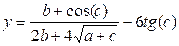

# Робота з типами даних

## Перелік усіх робіт

1. [Створення лінійної програми](lab-01.md)
2. [Робота з типами даних](lab-02.md)
3. [Введення-виведення даних у програмі](lab-03.md)
4. [Створення програми з розгалуженням](lab-04.md)
5. [Використання  циклів з параметром](lab-05.md)
6. [Використання  циклів з передумовою та післяумовою](lab-06.md)
7. [Використання функцій у программі](lab-07.md)
8. [Робота з одновимірним масивом](lab-08.md)
9. [Робота з двовимірним масивом](lab-09.md)
10. [Робота з рядкамиу програмі](lab-10.md)
11. [Опрацювання структур](lab-11.md)
12. [Опрацювання файлів](lab-12.md)
13. [Введення-виведення текстових даних в файл](lab-13.md)
14. [Створення класів ч.1](lab-14.md)
15. [Створення класів ч.2](lab-15.md)
16. [Використання механізму наслідування в класах](lab-16.md)
17. [Паралельні обчислення за допомогою стандарту OpenMP ч.1](lab-17.md)
18. [Паралельні обчислення за допомогою стандарту OpenMP ч.2](lab-18.md)
19. [Паралельні обчислення за допомогою стандарту OpenMP ч.3](lab-19.md)
20. [Паралельні обчислення за допомогою бібліотеки MPI](lab-20.md)

## Мета роботи 

Отримати навички роботи з типами даних в мовах програмування C та С++

## Обладнання

Персональний комп’ютер, Visual Studio 2008 або інша середа розробки для мови C++

## Теоретичні відомості

Для проведення математичних розрахунків використовуються наступні функції бібліотеки MATH, для використання яких необхідно включити файл заголовків `math.h`

|Прототип|Опис функції|
|--------|------------|
|abs(x)|Вертає абсолютне значення аргумента x|
|cos(x)|Вертає значення косінуса аргумента х (х задається в радіанах)|
|sin(x)|Вертає значення сінуса аргумента х. Кут х задається в радіанах|
|tan(x)|Вертає значення тангенсу аргумента х ( х задається в радіанах)|
|exp(x)|Вертає значення експонінціальної функціі (число Ейлера в ступені х)|
|log(x)|Вертає значення натурального логарифму ln(x)|
|log10(x)|Вертає значення десяткового логарифму ln10(x)|
|log10(x, y)|Вертає значення x в ступені y|
|sqrt(x)|Вертає додатнє значення квадратного кореня аргумента х|

Зв’язок між градусною та радіанною мірами кутів задається співвідношенням

360 градусів\=2π радіан

## Хід роботи

1. Завантажити Visual Studio 2008. Знайдіть на робочому столі ярлик з Visual Studio 2008 або Пуск → Всі програми→ Microsoft → Microsoft Visual Studio 2008.

2. Створити новий проект «Visual C++ (консольное приложение Win32)». Файл → Cтворити → Проект, тип проекту «Консольное приложение Win32».

3. Написати дві програми для обчислення значення виразу. Обрати програму за своїм номером варіанту та за наступним номером. Намалювати блок-схему.

	1.  
	2.  
	3.  
	4. 
	5.  

## Контрольні питання

1. Дайте характеристику типам даних в мові програмування С
2. Охарактеризуйте арифметичні операції мові програмування С
3. Охарактеризуйте логічні операції мові програмування С
4. Охарактеризуйте пріоритет операцій мови програмування С