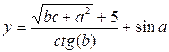
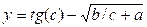

# Робота з типами даних. Використання бібліотек функцій

## Перелік усіх робіт

1. [Створення лінійної програми. Введення-виведення даних](lab-01.md)
2. [Робота з типами даних. Використання бібліотек функцій](lab-02.md)
3. [Створення програми з розгалуженням](lab-03.md)
4. [Використання циклів з параметром](lab-04.md)
5. [Використання циклів з передумовою та післяумовою](lab-05.md)
6. [Робота з одновимірним масивом](lab-06.md)
7. [Робота з багатовимірним масивом](lab-07.md)
8. [Робота з вказівниками](lab-08.md)
9. [Робота з рядками у програмі](lab-09.md)
10. [Робота зі структурами](lab-10.md)
11. [Створення користувацькийх функцій та бібліотек](lab-11.md)
12. [Робота з файлами за допомогою засобів STDIO](lab-12.md)
13. [Робота з файлами за допомогою засобів FSTREAM](lab-13.md)
14. [Робота з файлами за допомогою засобів WinAPI32](lab-14.md)
15. [Створення класів](lab-15.md)
16. [Перевантаження операторів](lab-16.md)
17. [Використання механізму наслідування в класах](lab-17.md)
18. [Паралельні обчислення за допомогою стандарту OpenMP ч.1](lab-18.md)
19. [Паралельні обчислення за допомогою стандарту OpenMP ч.2](lab-19.md)
20. [Паралельні обчислення за допомогою стандарту OpenMP ч.3](lab-20.md)

## Мета роботи 

Отримати навички роботи з типами даних в мовах програмування C та С++

## Обладнання

Персональний комп’ютер, Visual Studio 2008 або інша середа розробки для мови C++

## Теоретичні відомості

### Типи даних

Основні типи даних (див. табл. 3.1) часто називають арифметичними, тому що їх можна використовувати в арифметичних операціях. Для опису основних типів мови C++ використовують такі службові слова:

* int (цілий);
* char (символьний);
* bool (логічний);
* float (дійсний);
* double (дійсний з подвійною точністю);
* void (порожній, не має значення).

Типи int, char, bool називають цілими, а типи float та double — дійсними з плаваючою крапкою. Код, що формує компілятор для обробки цілих величин, відрізняється від коду для величин з плаваючою крапкою.

Для уточнення внутрішнього подання та діапазону значень стандартних типів мова C++ використовує чотири специфікатори типу:

* short (короткий);
* long (довгий);
* signed (знаковий);
* unsigned (беззнаковий).

### Заголовкові файли та підключення бібліотек

Багато бібліотечних функцій працюють зі своїми особливими типами даних і структурами, до яких програма повинна мати доступ. Ці структури та типи визначаються в заголовних файлах, що постачаються з компілятором, і вони (заголовні файли) повинні включатися (за допомогою #include) до кожного файлу, який використовує функції, на які вони посилаються. Крім того, всі бібліотечні функції мають прототипи, визначені в заголовному файлі. Це зроблено з двох причин. По-перше, в (С++ всі функції повинні мати прототипи. По-друге, хоча С створення прототипів і не є обов'язковим, їх використання настійно рекомендовано, оскільки воно забезпечує засіб для більш ретельного контролю типів. Включаючи в С-програму заголовкові файли, які відповідають стандартним функціям програми,можна виявити потенційні помилки розбіжності типів.

Найбільшуживані заголовкові файли у мові С:
|Файл|Опис|
|--|--|
|ALLOC.Н|Функції динамічного виділення пам'яті|
|ASSERT.H|Визначає макрос assert() (ANSI)|
|BIOS.H|Функції ROM-BIOS|
|CONIO.H|Функції для роботи з дисплеєм|
|CTYPE.H|Функції для роботи із символами (ANSI С)|
|DIR.H|Функції для роботи з каталогами|
|DOS.H|Функції інтерфейсу DOS|
|ERRNO.H|Визначає коди помилок (ANSI)|
|FCNTL.H|Визначає константи, що використовуються функцією ореn()|
|FLOAT.H|Визначає залежні від реалізації змінні з плаваючою точкою (ANSI С)|
|FSTREAM.H|Файл визначення вводу/виводу (С++)|
|GRAPHICS.Н|Графічні функції|
|IO.Н|UNIX-подібні процедури введення/виводу|
|IOMANIP.H|Визначає маніпулятори введення/виводу (С++)|
|IOSTREAM.H|Визначає класи потоків введення/виводу (С++)|
|LIMITS.Н|Визначає різні межі, що залежать від реалізації, (ANSI С)|
|LOCALE.Н|Функції, що залежать від країн та мов (ANSI С)|
|МАТН.Н|Різні визначення, що використовуються математичною бібліотекою (ANSI С)|
|PROCESS.H|Функції spawn() та ехес()|
|SETJMP.H|Нелокальні переходи (ANSI)|
|SHARE.H|Спільне використання файлів|
|SIGNAL.H|Визначає величини сигналів (ANSI)|
|STDARG.H|Списки аргументів довжин змінних (ANSI С)|
|STDDEF.H|Визначає деякі загальновживані константи (ANSI С)|
|STDIO.H|Оголошення для стандартних потоків вводу/виводу (ANSI C)|
|STDLIB.H|Різні визначення (ANSI С)|
|STRING.H|Обробка рядків (ANSI С)|
|STRSTREA.H|Класи потоків введення/виведення на базі масивів|
|TIME.H|Функції системного часу|


### Бібліотека MATH

Для проведення математичних розрахунків використовуються наступні функції бібліотеки MATH, для використання яких необхідно включити файл заголовків `math.h`

|Прототип|Опис функції|
|--------|------------|
|abs(x)|Вертає абсолютне значення аргумента x|
|cos(x)|Вертає значення косінуса аргумента х (х задається в радіанах)|
|sin(x)|Вертає значення сінуса аргумента х. Кут х задається в радіанах|
|tan(x)|Вертає значення тангенсу аргумента х ( х задається в радіанах)|
|exp(x)|Вертає значення експонінціальної функціі (число Ейлера в ступені х)|
|log(x)|Вертає значення натурального логарифму ln(x)|
|log10(x)|Вертає значення десяткового логарифму ln10(x)|
|log10(x, y)|Вертає значення x в ступені y|
|sqrt(x)|Вертає додатнє значення квадратного кореня аргумента х|

Зв’язок між градусною та радіанною мірами кутів задається співвідношенням

360 градусів\=2π радіан

## Хід роботи

1. Завантажити Visual Studio 2008. Знайдіть на робочому столі ярлик з Visual Studio 2008 або Пуск → Всі програми→ Microsoft → Microsoft Visual Studio 2008.

2. Створити новий проект «Visual C++ (консольное приложение Win32)». Файл → Cтворити → Проект, тип проекту «Консольное приложение Win32».

3. Перевірити роботу прикладу та намалювати блок-схему алгоритму
```cpp
#include <iostream>
using std::cin;
using std::cout;
using std::endl;
 
int main() 
{
    double a, h, p, s;
    cout << "Введите угол трапеции: ";
    cin >> a;
    cout << "Введите высоту трапеции: ";
    cin >> h;
    p = 2 * a + 2 * (h / sin(a)) * (1 + cos(a));
    s = (0,5 * (2 * a + ( (2 * h * cos(a)) / sin(a))) * h;
    cout << "Периметр равен: " << p;
    cout << "Площадь равна: " << s;
    system("PAUSE");
    return 0;
}
```

4. Написати дві програми для обчислення значення виразу. Обрати програму за своїм номером варіанту та за наступним номером. Намалювати блок-схему.

	1.  
	2.  
	3.  
	4. 
	5.  

5. Скласти звіт про роботу та відповісти на контрольні питання

## Контрольні питання

1. Дайте характеристику типам даних в мові програмування С
2. Охарактеризуйте арифметичні операції мові програмування С
3. Охарактеризуйте логічні операції мові програмування С
4. Охарактеризуйте пріоритет операцій мови програмування С

## Довідники та додаткові матеріали