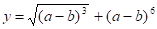
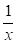

# Використання  циклів з передумовою та післяумовою

## Перелік усіх робіт

1. [Створення лінійної програми](lab-01.md)
2. [Робота з типами даних](lab-02.md)
3. [Введення-виведення даних у програмі](lab-03.md)
4. [Створення програми з розгалуженням](lab-04.md)
5. [Використання  циклів з параметром](lab-05.md)
6. [Використання  циклів з передумовою та післяумовою](lab-06.md)
7. [Використання функцій у программі](lab-07.md)
8. [Робота з одновимірним масивом](lab-08.md)
9. [Робота з двовимірним масивом](lab-09.md)
10. [Робота з рядкамиу програмі](lab-10.md)
11. [Опрацювання структур](lab-11.md)
12. [Опрацювання файлів](lab-12.md)
13. [Введення-виведення текстових даних в файл](lab-13.md)
14. [Створення класів ч.1](lab-14.md)
15. [Створення класів ч.2](lab-15.md)
16. [Використання механізму наслідування в класах](lab-16.md)
17. [Паралельні обчислення за допомогою стандарту OpenMP ч.1](lab-17.md)
18. [Паралельні обчислення за допомогою стандарту OpenMP ч.2](lab-18.md)
19. [Паралельні обчислення за допомогою стандарту OpenMP ч.3](lab-19.md)
20. [Паралельні обчислення за допомогою бібліотеки MPI](lab-20.md)

## Мета роботи 

Отримати навички роботи з функціями у мовах програмування C та С++, навчитися користуватися прототипами функцій

## Обладнання

Персональний комп’ютер, Visual Studio 2008 або інша середа розробки для мови C++

## Хід роботи

1. Завантажити Visual Studio 2008. Знайдіть на робочому столі ярлик з Visual Studio 2008 або Пуск → Всі програми→ Microsoft → Microsoft Visual Studio 2008.

2. Створити новий проект «Visual C++ (консольное приложение Win32)». Файл → Cтворити → Проект, тип проекту «Консольное приложение Win32».

3. Написати дві програми для обчислення виразу згідно з варіантом. Вказану частину виразу обчислити за допомогою функції.

	1.  для обчислення підвиразу  створити функцію 
	1.  для обчислення підвиразу  створити функцію 
	1.  для обчислення підвиразу  створити функцію 
	1.  для обчислення підвиразу  створити функцію 
	1.  для обчислення підвиразу  створити функцію 

## Контрольні питання

1. Яке призначення функції?
2. Напишіть загальний вигляд опису та оголошення функції:
3. Яке призначення оголошення функції?
4. Яке призначення типу void? 