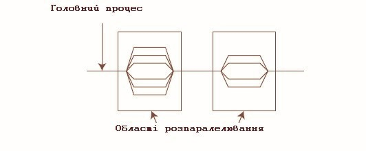

# Паралельні обчислення за стандартом OpenMP


## Перелік лекцій


1.  [Склад мови С++](lec-01.md)
2.  [Дані та операції](lec-02.md)
3.  [Організація введення-виведення даних](lec-03.md)
4.  [Основні оператори С++](lec-04.md)
5.  [Масиви у С++](lec-05.md)
6.  [Дані символьного типу](lec-06.md)
7.  [Функції](lec-07.md)
8.  [Дані типу структура](lec-08.md)
9.  [Покажчики у С++](lec-09.md)
10. [Робота з динамічною пам'ятю](lec-10.md)
11. [Робота з файлами](lec-11.md)
12. [Обробка файлів за допомогою WinAPI32](lec-12.md)
13. [Об'єктно-орієнтоване програмування. Класи](lec-13.md)
14. [Методи та властивості. Екземпляри класу](lec-14.md)
15. [Паралельні обчислення за стандартом OpenMP](lec-15.md)
16. [Паралельні обчислення з бібліотекою MPI](lec-16.md)


##  Технологія OpenMP 

OpenMP (Open specifications for Multi-Processing) - це набір специфікацій  для паралелізації програм у середовищі із загальною пам'яттю. Інтерфейс OpenMP задуманий для програмування на масштабованих SMP-системах (SSMP, ccNUMA ) в моделі загальної пам'яті (shared memory model). У стандарт OpenMP входять специфікації набору директив компілятора, процедур і змінних середовища. 
OpenMP дозволяє легко і швидко створювати багатопоточні додатки на алгоритмічних мовах Fortran і C/C++. При цьому директиви OpenMP аналогічні директивам препроцесора для мови C/C++ і є аналогом коментарів у алгоритмічній мові Fortran. Це дозволяє в будь-який момент розробки паралельної реалізації програмного продукту при необхідності повернутися до послідовного варіанту програми. 

OpenMP - це стандартна модель для паралельного програмування в середовищі зі спільною пам'яттю. У даній моделі всі процеси спільно використовують загальний адресний простір, до якого вони асинхронно звертаються із запитами на читання і запис. У таких моделях для управління доступом до загальної пам'яті використовуються різні механізми синхронізації типу семафорів та блокування процесів. Перевага цієї моделі з точки зору програмування полягає в тому, що поняття монопольного володіння даними відсутнє, отже, не потрібно явно задавати обмін даними між потоками, що їх задають, та потоками, що їх використовують. Ця модель, з одного боку, спрощує розробку програми, але, з іншого боку, ускладнює розуміння і управління локальністю даних, написання детермінованих програм. В основному вона використовується при програмуванні для архітектур зі спільною пам'яттю. 
Прикладами систем зі спільною пам'яттю, які мають велике число процесорів, можуть служити суперкомп'ютери Cray Origin2000 (до 128 процесорів), HP 9000 V-class (до 32 процесорів в одному вузлі, а в конфігурації з 4 вузлів - до 128 процесорів), Sun Starfire (до 64 процесорів). 

### Підтримка стандарту
В даний час OpenMP підтримується більшістю розробників паралельних обчислювальних систем: компаніями Intel, Hewlett-Packard, Silicon Graphics, Sun, IBM, Fujitsu, Hitachi, Siemens, Bull і іншими. 
Компілятори gcc і gfortran мають вбудовану підтримку паралелізації OpenMP починаючи з версії 4.2. Для використання цієї можливості слід додати ключ -fopenmp при компіляції. OpenMP версії 3.0 підтримується починаючи з версії gcc 4.4. OpenMP 2.5 підтримується також компілятором Microsoft Visual C++ 2005 (слід використовувати ключ /openmp) і компіляторами Intel C або Intel Fortran починаючи з версії 10.1 (ключ -openmp). 

### Основи OpenMP 
Будь-яка програма, послідовна або паралельна, складається з набору областей двох типів: послідовних областей і областей розпаралелювання. При виконанні послідовних областей породжується тільки один головний потік виконання (процес). У цьому потоці ініціюється виконання програми, а також відбувається її завершення. У паралельній програмі в областях розпаралелювання породжується цілий ряд паралельних потоків. Породжені паралельні потоки можуть виконуватися як на різних процесорах, так і на одному процесорі обчислювальної системи. В останньому випадку паралельні процеси (потоки) конкурують між собою за доступ до процесора. Управління конкуренцією здійснюється планувальником операційної системи за допомогою спеціальних алгоритмів.  
  


При виконанні паралельної програми робота починається з ініціалізації і виконання головного потоку (процесу), який у міру необхідності створює і виконує паралельні потоки виконання, передаючи їм необхідні дані. Паралельні потоки з однієї паралельної області програми можуть виконуватися як незалежно один від одного, так і з пересиланням та отриманням повідомлень від інших паралельних потоків. Остання обставина ускладнює розробку програми, оскільки в цьому випадку програмістові доводиться займатися плануванням, організацією і синхронізацією посилки повідомлень між паралельними потоками. Таким чином, при розробці паралельної програми бажано виділяти такі області розпаралелювання, в яких можна організувати виконання незалежних паралельних потоків. Для обміну даними між паралельними процесами (потоками) в OpenMP використовуються загальні змінні. При зверненні до загальних змінних у різних паралельних потоках можливе виникнення конфліктних ситуацій при доступі до даних. Для запобігання конфліктів можна скористатися процедурою синхронізації. При цьому треба мати на увазі, що процедура синхронізації - дуже дорога операція по тимчасових витратах і бажано по можливості уникати її або застосовувати якомога рідше. Для цього необхідно дуже ретельно продумувати структуру даних програми. 
Виконання паралельних потоків в паралельній області програми починається з їх ініціалізації. Вона полягає у створенні дескрипторів породжуваних потоків і копіюванні всіх даних з області даних головного потоку в області даних паралельних потоків, що створюються. Ця операція надзвичайно трудомістка - вона еквівалентна приблизно трудомісткості не менше 1000 машинних команд. Ця оцінка надзвичайно важлива при розробці паралельних програм c допомогою OpenMP, оскільки її ігнорування веде до створення неефективних паралельних програм, які виявляються часто повільнішими ніж їх послідовні аналоги. Справді: для того щоб отримати виграш у швидкодії паралельної програми, необхідно, щоб трудомісткість паралельних процесів в областях розпаралелювання програми істотно перевершувала б трудомісткість породження паралельних потоків. В іншому випадку ніякого виграшу за швидкодією отримати не вдасться, а часто можна опинитися навіть і в програші. 
Після завершення виконання паралельних потоків управління програмою знову передається головному потоку. При цьому виникає проблема коректної передачі даних від паралельних потоків головного. Тут важливу роль грає синхронізація завершення роботи паралельних потоків, оскільки в силу цілого ряду обставин час виконання навіть однакових за трудомісткістю паралельних потоків непередбачувано (воно визначається як історією конкуренції паралельних процесів, так і поточним станом обчислювальної системи). При виконанні операції синхронізації паралельні потоки, вже завершили своє виконання, простоюють і чекають завершення роботи самого останнього потоку. Природно, при цьому неминуча втрата ефективності роботи паралельної програми. Крім того, операція синхронізації має трудомісткість, порівнянну з трудомісткістю ініціалізації паралельних потоків. 
 
### Переваги OpenMP

1.	За рахунок ідеї "інкрементального розпаралелювання" OpenMP ідеально підходить для розробників, хто хоче швидко розпаралити свої обчислювальні програми з великими циклами. Розробник не створює нову паралельну програму, а просто послідовно додає в текст послідовної програми OpenMP-директиви. 
2.	При цьому, OpenMP - досить гнучкий механізм, що надає розробнику великі можливості контролю над поведінкою паралельного програми.  
3.	Передбачається, що OpenMP-програма на однопроцесорній платформі може бути використана як послідовна програма, тобто немає необхідності підтримувати послідовну і паралельну версії. Директиви OpenMP просто ігноруються послідовним компілятором, а для виклику процедур OpenMP можуть бути підставлені заглушки (stubs), текст яких наведений у специфікаціях [17]. 
Далі наведено короткий опис специфікації OpenMP та наведено приклади використання в програмах на алгоритмічних мовах C і Фортран. Матеріал включає короткий опис основних директив OpenMP, процедур і змінних середовища. Для вивчення всіх тонкощів використання OpenMP слід звертатися до керівництва користувача [17] та книг [1-4]. 

## Прагми OpenMP 
Специфікація OpenMP визначає набір прагм. Прагма - це директива компілятора що вказує, як обробляти код, який слідує за нею. Найбільш суттєвою є прагма #pragma omp parallel, що визначає область паралельності. 
Коли прагми OpenMP використовуються в програмі, вони дають вказівку компілятору, що підтримує OpenMP, створити виконуваний модуль, який буде виконуватися паралельно з використанням декількох потоків. При цьому в вихідний код необхідно внести достатньо невеликі зміни.   
 
`#pragma omp конструкція [пропозиція [пропозиція] ...]` 


Для звичайних послідовних програм директиви OpenMP не змінюють структуру і послідовність виконання операторів. Таким чином, звичайна послідовна програма зберігає свою працездатність. У цьому й полягає гнучкість розпаралелювання за допомогою OpenMP.  

Директиви можна розділити на 3 категорії: 

* визначення паралельної секції,  
* розподіл роботи,  
* синхронізація.  

Кожна директива може мати кілька додаткових атрибутів - клауз (clause) . Окремо специфікуються клаузи для призначення класів змінних, які можуть бути атрибутами різних директив. 
Більшість директив OpenMP застосовується до структурних блоків. Структурні блоки - це послідовності операторів з однією точкою входу на початку блоку і однією точкою виходу в кінці блоку. 
У OpenMP використовується модель паралельного виконання "розгалуження-злиття". Програма OpenMP починається як единий потік виконання (так званий початковий потік). Коли потік зустрічає паралельну конструкцію, він створює нову групу потоків, що складається з себе і невід'ємного числа додаткових потоків, і стає головним у новій групі. Всі члени нової групи (включаючи головний потік) виконують код всередині паралельної конструкції. У кінці паралельної конструкції є неявний бар'єр. Після паралельної конструкції виконання користувацького коду продовжує тільки головний потік. 
Кількість потоків у групі, що виконуються в області паралельності, можна контролювати декількома способами. Один з них - використання змінної середовища OMP_NUM_THREADS. Інший спосіб - виклик процедури omp_set_num_threads(). Ще один спосіб - використання клаузи num_threads у поєднанні з прагмою parallel. 
У OpenMP підтримуються дві основних конструкції розділення праці для зазначення того, що роботу в області паралельності слід розділити між потоками групи. Ці конструкції розділення праці - цикли і розділи. прагма `#pragma omp for` використовується для циклів, а прагма `#pragma omp sections` використовується для розділів - блоків коду, які можуть бути виконані паралельно. 
Прагма `#pragma omp barrier` дає всіх потоків вказівку чекати один одного перед тим, як вони продовжать виконання за бар'єром. Як було зазначено вище, в кінці області паралельності є неявний бар'єр. Прагма `#pragma omp master` дає компілятору вказівку про те, що наступний блок коду повинен виконуватися тільки головним потоком. Прагма `#pragma omp single` показує, що наступний блок коду повинен виконуватися тільки одним потоком групи; цей потік не обов'язково повинен бути головним. Прагма `#pragma omp critical` може використовуватися для захисту блоку коду, який повинен виконуватися одночасно тільки одним потоком. Звичайно, всі ці прагма мають сенс тільки в контексті прагма parallel (області паралельності). 


### Виділення паралельної області

C/C ++:

`#pragma omp parallel [ ключ [ ключ ] ... ] new-line structured-block` 


Ключі визначають типи змінних і їх поведінка при вході в паралельну область і виході з неї.
Можливі ключі:

IF (умова) - Виконання паралельної області за умовою. Входження в паралельну область відбувається тільки, якщо умова приймає значення <істина>.

SHARED (список) - Явно визначає список змінних, які повинні бути загальними для всіх ниток паралельної області.

PRIVATE (список) - Визначає список змінних, які повинні бути локальними для кожної нитки. При вході в паралельну область для кожної нитки створюється окремий екземпляр, який не має ніякого зв'язку з оригінальною змінної поза паралельної області. Зміна значення локальної змінної будь-якої ниткою ні як не впливає на значення цієї змінної в інших нитках.

FIRSTPRIVATE (список) - Список локальних змінних, які при вході в паралельну область успадковують значення оригінальних змінних.

DEFAULT (PRIVATE | FIRSPRIVATE | SHARED | NONE) - Всім змінним в паралельній області, яким явно не призначений клас, буде призначений клас PRIVATE, FIRSTPRIVATE або SHARED відповідно. Значення NONE вказує, що значення за замовчуванням жодним змінним не встановлюється. У мовах C / C ++ допустимі тільки значення SHARED або NONE .

REDUCTION (операція: список) - Операція редукції проводиться над копіями змінних у всіх нитках, і результат присвоюється базової змінної.

Допустимі операції:

C / C ++:
+, \*, -, &, ^, |, &&, or, ||


COPYIN (список) - Застосовується до глобальних змінних в С/С++ і COMMON-блокам в Фортране, які позначені як THREADPRIVATE . При вході в паралельну область приватні копії цих даних ініціюються оригінальними значеннями.

NUM_THREADS (цілочисельне вираз) завдання кількості ниток, що породжуються в паралельній області. За замовчуванням вибирається останнє значення, встановлене за допомогою функції omp_set_num_threads () , або значення змінної OMP_NUM_THREADS .
Програма paralel.c
```cpp
#include <omp.h> 
main () {
	int nthreads, tid;
	/* Генерація ансамблю ниток */
	#pragma omp parallel private (tid)
	{
	/* Отримання та друк ідентифікаторів ниток */
		tid = omp_get_thread_num ();
		printf ( "Hello World from thread =% d \n", tid);
		/* Визначення майстер-ниткою загального числа ниток */
		if (tid == 0) 
		{
			nthreads = omp_get_num_threads ();
			printf ( "Number of threads =% d \n", nthreads);
		}
	} /* Закриття всіх ниток, крім майстер-нитки */
 }
```

Створення паралельних областей саме по собі не призводить до прискорення роботи програми, Кожна нитка буде виконувати одну і ту ж послідовність команд. Для розподілу роботи між нитками служать спеціальні директиви.

У OpenMP є кілька можливостей щодо розподілу обчислень між нитками.

### Поділ роботи, паралельні цикли

Директива для розподілу ітерацій циклу між нитками:

C/C++:

`#pragma omp for [ ключ [ ключ ] ...] new-line Цикл for`


У список допустимих ключів входять всі ключі директиви PARALLEL . Це дозволяє об'єднувати інструкції PARALLEL / END PARALLEL і DO / END DO в пару PARALLEL DO / END PARALLEL DO (parallel for в мовах C / C ++).

Крім ключів загальних з оператором PARALLEL , є ключі специфічні для оператора for / DO :

SCHEDULE (тип [, m]) - вказує, яким чином ітерації циклу будуть розподілені між нитками групи. Як параметр "тип" можна вказати наступні значення:

STATIC - блочно-циклічне розподіл ітерацій блоками розміру m. Якщо m не визначене, то розмір блоку визначається діленням числа ітерацій на число ниток. Таким чином, кожної нитки дістається один блок. У разі, якщо число ітерацій не ділитися без остачі на число потоків, то компілятор сам розподілить залишок між нитками.

DYNAMIC - динамічний розподіл ітерацій з фіксованим розміром блоку m: спочатку всі нитки отримують порції з m ітерацій, а потім кожна нитка, що закінчує свою роботу, отримує наступну порцію з m ітерацій. За замовчуванням m = 1.

GUIDED - динамічний розподіл ітерацій блоками зменшується розміру; аналогічно розподілу DYNAMIC , але розмір виділених блоків весь час зменшується, що в ряді випадків дозволяє акуратніше збалансувати завантаження ниток. При керованому плануванні число ітерацій, виконуваних кожним потоком, визначається за такою формулою:

чісло_виполняемих_потоком_ітерацій = 
max (чісло_нераспределенних_ітерацій / чісло_нітей, m)

Параметр m визначає мінімальний розмір блоку. За замовчуванням m = 1.

RUNTIME - спосіб розподілу ітерацій циклу вибирається під час роботи програми в залежності від значення змінної OMP_SCHEDULE . Для цього типу розподілу параметр m не ставить.

AUTO - спосіб розподілу ітерацій вибирається компілятором або середовищем виконання. Параметр m не ставить.

LASTPRIVATE (список) - список змінних, які після закінчення паралельного блоку повинні бути збережені в базових змінних. Зберігаються значення з останнього кроку циклу.

ORDERED - дозволяє задавати всередині тіла циклу директиви ORDERED, які впорядковують послідовність виконання кроків циклу.

COLLAPSE (n) - Вказує, скільки вкладених циклів повинні утворити єдиний простір ітерацій, яке ділиться між нитками відповідно до ключа SCHEDULE .

NOWAIT - директива скасовує необхідність бар'єрної синхронізації ниток в кінці паралельного циклу.

Приклад програми з розподілом ітерацій циклу між нитками:

програма for.c
```cpp
#include <stdio.h>
#include <stdlib.h>
#define TRUE 1
int main ()
{
	int i, n = 18;
	omp_set_num_threads (4);
	/* Функція omp_set_num_threads задає число ниток в паралельному регіоні */
	#pragma omp parallel default (none) shared (n) private (i)
	{
	#pragma omp for schedule (static)
	for (i = 0; i <n; i ++)
		printf ( "Нитка% d виконує% d ітерацію \n",
			omp_get_thread_num (), i);
		/* Функція omp_get_thread_num () визначає номер викликала її нитки */
	}
return 0;
}
```


### Директиви синхронізації 
MASTER ... END MASTER 
Визначає блок коду, який буде виконанувати тільки master (нульовий потік). 
CRITICAL ... END CRITICAL 
Визначає критичну секцію, тобто блок коду, який не повинен виконуватися одночасно двома або більше потоками. 
BARRIER 
Визначає точку бар'єрної синхронізації, в якій кожен потік чекає всіх інших. 
ATOMIC 
Визначає змінну в лівій частині оператора "атомарного" присвоювання, яка повинна коректно оновлюватися декількома потоками. 
ORDERED ... END ORDERED 
Визначає блок усередині тіла циклу, який повинен виконуватися в тому порядку, в якому ітерації йдуть у послідовному циклі. Може використовуватися для впорядкування виведення від паралельних потоків виконання. 
FLUSH 
Явно визначає точку, в якій реалізація повинна забезпечити однаковий зміст пам'яті для всіх потоків. Неявно FLUSH присутній у наступних директивах: 
BARRIER, CRITICAL, END CRITICAL, END DO, END PARALLEL, END SECTIONS, END SINGLE, ORDERED, END ORDERED. 
Для синхронізації можна також користуватися механізмом замків (locks). 
### Класи змінних 
В OpenMP змінні в паралельних областях програми розділяються на два основні класи:  
* SHARED (глобальні; під ім'ям A всі потоки бачать одну змінну) 
* PRIVATE (приватні; під ім'ям A кожен потік бачить свою змінну). 
Окремі правила визначають поведінку змінних при вході і виході з паралельної області або паралельного циклу: REDUCTION, FIRSTPRIVATE, LASTPRIVATE, COPYIN. 
За замовчуванням, всі COMMON-блоки, а також змінні, породжені поза паралельною областю, при вході в цю область залишаються глобальними (SHARED). Виняток становлять змінні - лічильники ітерацій в циклі, з очевидних причин. Змінні, породжені всередині паралельної області, є приватними (PRIVATE). Явно призначити клас змінних за замовчуванням можна за допомогою клаузи DEFAULT. 
SHARED 
Застосовується до змінних, які необхідно зробити глобальними. 
PRIVATE 
Застосовується до змінних, які необхідно зробити приватними. При вході в паралельну область для кожного потоку виконання створюється окремий екземпляр змінної, який не має жодного зв'язку з оригінальною змінною поза паралельною областю. 
THREADPRIVATE 
Застосовується до COMMON-блоків, які необхідно зробити приватними. Директива повинна застосовуватися після кожної декларації COMMONблоку. 
FIRSTPRIVATE 
Приватні копії змінної при вході в паралельну область ініціалізуються значенням оригінальної змінної. 
LASTPRIVATE 
Після закінчення паралельно циклу або блоку паралельних секцій, потік, який виконав останню ітерацію циклу або останню секцію блоку, оновлює значення оригінальної змінної. 
REDUCTION(+:A) 
Вказує на змінну, з якою в циклі здійснюється операція редукції (наприклад, в даному випадку підсумовування). При виході з циклу, дана операція проводиться над копіями змінної у всіх потоках, і результат присвоюється оригінальній змінній. 
COPYIN 
Застосовується до COMMON-блоків, які позначені як THREADPRIVATE. При вході в паралельну область приватні копії цих даних ініціалізуються оригінальними значеннями. 
##	Процедури і змінні середовища 
У OpenMP передбачений також набір бібліотечних процедур, які дозволяють:  
* під час виконання контролювати і запитувати різні параметри, що визначають поведінку програми (такі як число потоків і процесорів, можливість вкладеного паралелізму); процедури призначення параметрів мають пріоритет над відповідними змінними середовища.  
* використовувати синхронізацію на базі замків (locks). 
З метою створення можливості запуску паралельних програм в різних умовах, в OpenMP визначено також ряд змінних середовища, які контролюють поведінку програми. 
###	Процедури OpenMP 
OpenMP надає ряд процедур, які можна використовувати для отримання інформації про потоки у програмі. До їх число належать 
omp_get_num_threads(),mp_set_num_threads(),omp_get_max_threads(), omp_in_parallel() та інші. Крім того, OpenMP надає ряд процедур блокування, які можна використовувати для синхронізації потоків, а також процедури для визначення поточного часу. 
### Процедури для контролю/запиту параметрів середовища виконання 
OMP_SET_NUM_THREADS 
Дозволяє призначити максимальне число потоків для використання в наступній паралельної області (якщо це число дозволено міняти динамічно). Викликається з послідовної області програми. 
OMP_GET_MAX_THREADS 
Повертає максимальне число потоків. 
OMP_GET_NUM_THREAD 
